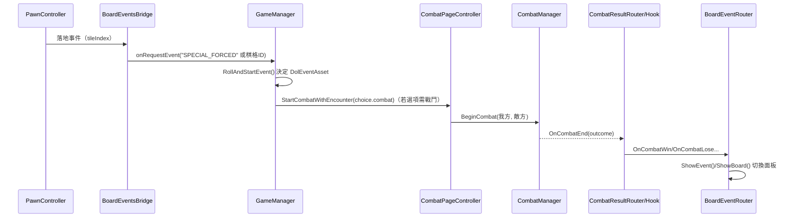

# 專案架構說明

## 系統總覽
本專案以單一場景承載棋盤、事件與戰鬥三大介面，由 `GameManager` 驅動劇情事件與戰鬥啟動流程。棋盤區域 (`Game.Board` 與 `CyberLife.Board`) 透過 `PawnController` 控制移動，`BoardEventsBridge` 在棋子落地時決定要打開事件頁或觸發戰鬥請求；劇情事件由 `GameManager` 配合 `CaseDatabase` 與 `EventFlagStorage` 決定可觸發的 `DolEventAsset`，並產生 UI 選項。當選項標記 `startsCombat` 時，`CombatPageController` 會建立戰鬥隊伍並呼叫 `CombatManager` 進行回合判定，結果再交由 `CombatResultRouter` 或 `CombatResultHook` 回傳給 `BoardEventRouter`，切換回事件或棋盤頁。`BoardEventRouter` 是畫面顯示的中樞，負責在三個 Panel 之間切換，並與既有的 `MenuManager` 互操作。

## 模組責任表
| 模組 | 命名空間 / 代表類別 | 核心責任 | 主要依賴 / 互動 |
| --- | --- | --- | --- |
| 棋盤 (`Game.Board`、`CyberLife.Board`) | `PawnController`、`BoardController`、`BoardEventsBridge` | 產生棋盤格、控制棋子移動並於落點發出事件 / 戰鬥請求；調整棋盤 UI 版面 | `DiceRoller` 決定步數、`BoardEventRouter` 切換面板、`GameManager` 處理事件內容 |
| 事件 (`GameManager` 等) | `GameManager`、`CaseDatabase`、`EventFlagStorage`、`DolEventAsset` | 管理劇情狀態、旗標與數值，建立事件選項並根據結果更新 `PlayerStats` | 監聽 `BoardEventsBridge` 的請求、驅動 `CombatPageController`、經由 `BoardEventRouter`/UI 呈現 |
| 戰鬥 (`CyberLife.Combat`) | `CombatPageController`、`CombatManager`、`CombatUIController`、`CombatResultRouter`、`EventCombatBridge` | 佈署敵我單位、處理攻防結算、自動補齊 `BasicHealth`，並在戰鬥結束時產生結果事件 | 接收 `GameManager` 或 `EventCombatBridge` 的開戰需求，透過 `CombatResultRouter` 或 `CombatResultHook` 回傳 `BoardEventRouter` |
| UI (`Game.UI`) | `BoardEventRouter`、`RollButtonBinder`、`PageSwitcher`、`UICameraPageBinder` | 管理面板顯示、擲骰按鈕熱鍵、相機對齊與頁面切換 | 反射呼叫 `TurnManager`/`PawnController`、接收戰鬥結果、與 `MenuManager` 兼容 |
| 編輯器 (`Assets/KG/Editor`) | `BoardAutoWire`、`BoardLayoutFix(_Safe)`、`BoardMenu(Fixed)`、`CombatTools_KG`、`UIQuickSizer` | 提供自動配線、版面修正與戰鬥配線報表輸出工具 | 透過 `Undo`/`EditorUtility` 操控場景物件，依賴執行階段腳本的 API 與命名空間 |

## 結構圖
```mermaid
graph TD
    Pawn[Game.Board.PawnController]
    Bridge[CyberLife.Board.BoardEventsBridge]
    Manager[GameManager]
    EventUI[事件/故事 UI]
    CombatPage[CyberLife.Combat.CombatPageController]
    CombatMgr[CyberLife.Combat.CombatManager]
    Result[CombatResultRouter 或 CombatResultHook]
    Router[Game.UI.BoardEventRouter]
    Panels[Board/Event/Combat Panels]
    Menu[MenuManager (透過反射)]

    Pawn -->|落地通知| Bridge
    Bridge -->|onRequestEvent / onRequestCombat| Manager
    Manager --> EventUI
    Manager -->|startsCombat| CombatPage
    CombatPage -->|BeginCombat| CombatMgr
    CombatMgr -->|OnCombatEnd| Result
    Result -->|ShowBoard/Event| Router
    Router --> Panels
    Router -.->|ReturnToBoard()| Menu
    Router -->|SendMessage| Result
```

## 互動流程


## 關鍵檔案清單
- **Assets/Scripts/GameManager.cs**：劇情主控，處理事件抽選、旗標/數值更新與戰鬥啟動。 
- **Assets/Scripts/UI/BoardEventRouter.cs**：控制棋盤、事件、戰鬥三個 Panel 的顯示與互斥。 
- **Assets/Scripts/UI/RollButtonBinder.cs**：擲骰按鈕與鍵盤快捷的反射綁定器，自動尋找 `TurnManager` 或 `PawnController`。 
- **Assets/Scripts/Board/BoardController.cs**：依面板尺寸產生棋盤格並自動調整棋子與 UI 配置。 
- **Assets/Scripts/Board/PawnController.cs**：驅動棋子移動、對齊位置與補間。 
- **Assets/Scripts/Board/BoardEventsBridge.cs**：橋接棋盤落地到事件/戰鬥請求，亦可強制切換事件頁。 
- **Assets/Scripts/Combat/CombatPageController.cs**：建立戰鬥場景、補齊敵我單位並呼叫 `CombatManager`。 
- **Assets/Scripts/Combat/CombatManager.cs**：戰鬥流程核心，補掛 `BasicHealth`、進行攻防與勝負判定。 
- **Assets/Scripts/Combat/CombatResultRouter.cs**：根據戰鬥結果觸發 UnityEvent，或輪詢 `CombatManager`。 
- **Assets/Scripts/Combat/EventCombatBridge.cs**：從事件系統啟動戰鬥並載入戰鬥場景。 
- **Assets/Scripts/Combat/CombatUIController.cs**：戰鬥 UI 互動與 HP 顯示、部位選擇。 
- **Assets/Scripts/Combat/CombatResultHook.cs**：以 `SendMessage` 方式把戰鬥結果導向 `BoardEventRouter`。 
- **Assets/KG/Editor/CombatTools_KG.cs**：輸出戰鬥配線報表與專案資產清單。 
- **Assets/KG/Editor/BoardAutoWire.cs**：自動指派 `PawnController` 的棋盤/棋子參考。 
- **Assets/KG/Editor/BoardLayoutFix*.cs**：修正棋盤相關 UI 的 Anchor 與棋子對齊。 
- **Assets/KG/Editor/BoardMenu(Fixed).cs**：快速建立棋盤 Canvas 與 `PawnController`、Roll 按鈕。

## 差異與建議
- `BoardEventsBridge` 期待 `PawnController` 具備 `onLanded` 事件，但現行 `PawnController` 沒有 UnityEvent，導致橋接器無法在落地時被呼叫。建議在 `PawnController` 補上落地事件或改為由 `BoardController` 發送。 
- `PawnController` 目前定義於 `Game.Board` 命名空間，但多處（如 `BoardEventsBridge`、`BoardMenu(Fixed)`）使用 `CyberLife.Board.PawnController`。需統一命名空間或新增別名類型以避免編譯錯誤與 `AddComponent` 失敗。 
- 多個路由元件採用反射與 `SendMessage`（例如 `BoardEventRouter` 反射呼叫 `MenuManager`，`CombatResultHook` 以字串呼叫方法）。在專案穩定後可考慮改為序列化引用或介面，以降低錯誤風險並利於 AOT。 
- `BoardEventsBridge` 預設 `forceSpecialEveryLanding = true` 會在每次落地即切換至事件頁，可能與傳統大富翁式流程不同；建議在正式流程中改為以棋格規則判斷，避免失去棋盤節奏。 
- `GameManager` 透過 `FindObjectOfType` 自動尋找 `CombatPageController`；若場景切分或載入位於 Additive 場景時，請確保搜尋範圍與載入順序，或改以明確引用提升穩定性。 
- 編輯器工具 `BoardMenu(Fixed)` 會直接建立並加上 `CyberLife.Board.PawnController`；在腳本命名空間未統一前會失敗。使用前請先調整或更新腳本。

## 驗證步驟
1. **棋盤移動**：於 Unity 開啟 Sample Scene，執行 `KG/Board/Auto Wire (Scene)` 確認 `PawnController` 已指向 `Tiles` 與棋子後，進入 Play Mode 按下 Roll 按鈕或熱鍵，檢查棋子是否沿 `BoardController` 產生的格子移動。 
2. **事件與戰鬥切換**：在 Play Mode 觸發棋子落地後的事件，於選項中挑選 `startsCombat` 的選項，確認 `GameManager` 會呼叫 `CombatPageController` 啟動戰鬥、面板由 `BoardEventRouter` 切換至戰鬥 UI。 
3. **戰鬥結果回傳**：戰鬥結束時觀察 `CombatResultRouter` 是否驅動 `BoardEventRouter` 返回事件頁，並確認 `CombatResultHook`（若有掛載）可成功用 `SendMessage` 呼叫。 
4. **戰鬥配線檢查**：在 Editor 模式執行 `KG/Combat/Dump Wiring`，檢查輸出的 `Assets/CombatWiringReport.txt` 是否列出 `CombatManager`、`CombatPageController` 等關鍵物件及其參考。 
5. **UI 尺寸快速確認**：使用 `KG/UI/CanvasScaler → 1920x1080` 與 `KG/UI/TMP AutoSize` 工具，確保棋盤與戰鬥 UI 在標準解析度下版面正常（操作後可按 Undo 還原）。
