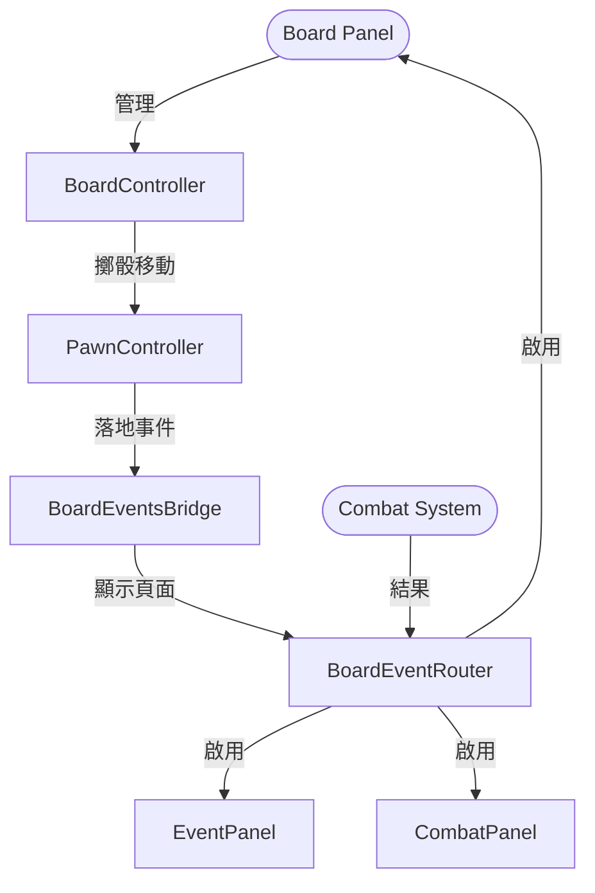
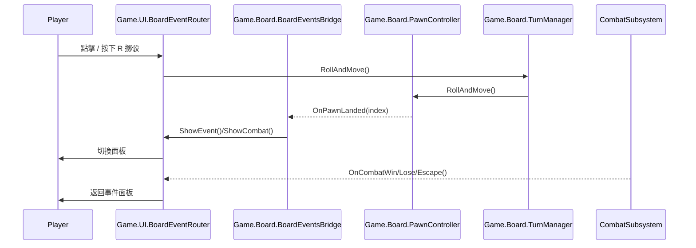

# 棋盤系統架構說明

## 系統總覽

## 模組責任
| 模組 | 職責 | 關鍵檔案 |
| --- | --- | --- |
| Game.Board | 棋盤生成、棋子移動、自動縮放與事件判斷 | `Assets/Scripts/Board/BoardController.cs`、`Assets/Scripts/Board/PawnController.cs`、`Assets/Scripts/Board/BoardAutoFitPerimeter.cs`、`Assets/Scripts/Board/BoardEventsBridge.cs`、`Assets/Scripts/Board/PawnAutoSizeToTile.cs` |
| Game.UI | 介面切換、擲骰按鈕綁定、Board/Combat/Event 面板顯示 | `Assets/Scripts/UI/BoardEventRouter.cs`、`Assets/Scripts/UI/RollButtonBinder.cs`、`Assets/Scripts/Bridges/MenuBridge.cs` |

## 差異與建議
- 移除 `Assets/KG/Editor/KG.Editor.asmdef`：改回預設 Editor 組件以直接參考 Runtime 類別。
- `Assets/Scripts/UI/BoardEventRouter.cs` 改為單純顯示切換，所有事件/戰鬥路徑統一指向此 Router。
- 將 `Assets/BoardAutoFitPerimeter.cs` 移至 `Assets/Scripts/Board/BoardAutoFitPerimeter.cs` 並強化為僅縮放 Tiles + 置中，避免與其他 RectTransform 調整腳本互撞。
- `Game.Board.BoardZoomToFit` 在 Play 模式會自動停用，避免與新的 Tiles 縮放流程重複；若需編輯器工具可於 Edit Mode 使用。

## 驗證步驟
1. Unity 進入 Play：確認 Console 無編譯錯誤、棋盤保持在面板內且四周邊距均勻。
2. 在 Board → Event → Combat → Board 的切換流程中，Tiles 與 Pawn 不會位移或縮放錯亂。
3. 按下 R 或點擊擲骰按鈕可驅動 `TurnManager.RollAndMove()`，棋子會依序走步並落點顯示事件或戰鬥。
4. 將視窗尺寸調整或切換頁面回到棋盤，Tiles 會重新 Fit 並保持置中。
